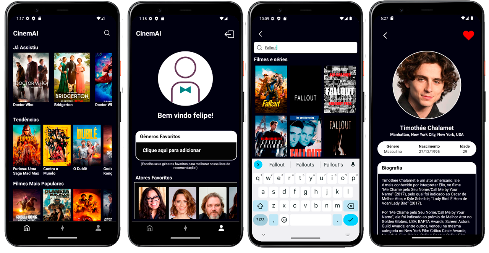

# CinemAI

## Sobre o projeto

CinemAI é um aplicativo React Native desenvolvido com Expo, que permite aos usuários explorar atores, filmes e séries, adicionar itens às suas listas de favoritos e assistidos, descobrir novas recomendações através da inteligência artificial e muito mais.

## Recursos

- **Explorar filmes e séries:** Visualize informações detalhadas sobre filmes e séries, incluindo sinopse, elenco, data de lançamento, classificação e gêneros.
- **Favoritos e Assistidos:** Você consegue manter seu histórico de filmes/séries assistidos e favoritos.
- **Pesquisar:** Encontre filmes e séries por título.
- **Perfil do usuário:** Personalize seu perfil com seus gêneros de filmes e séries favoritos, atores favoritos para melhorar a recomendação por Inteligência Artificial.
- **Recomendações:** Descubra novas recomendações com base em seus gostos e preferências através do modelo de linguagem grande Gemini.

## Instalação e execução

**Requisitos:**

- Node.js e npm (ou yarn) instalados.
- Expo CLI instalado: `npm install -g expo-cli` ou `yarn global add expo-cli`

**Clonar o repositório e instalar depedências:**

```bash
 # Clone o repositório:
 git clone https://github.com/felipemorgado/app-cinemai.git

 # Navegue até a pasta do projeto:
 cd cinemai

 # Instale as dependências:
 npm install
 # ou
 yarn install
```

**Pegando as API KEYs:**

## OBS: PARA A ENTREGA DO TCC GERAMOS NOVAS KEYS, ENTÃO NÃO SERÁ PRECISO FAZER ESSA ETAPA, SIGA PARA [Executando o .apk de desenvolvimento](#executando-o-apk-de-desenvolvimento)

(_Se você não deseja pegar as API KEY e só rodar o aplicativo vá para [Executando o .apk de desenvolvimento](#executando-o-apk-de-desenvolvimento)_)

Com o node, expo cli e as dependências instaladas, basta abrir a pasta do projeto no VSCode e criar o arquivo `.env.local`. Nesse arquivo você vai colocar as API Key do Firebase, TMDB e do Gemini, igual demostrado no arquivo ja existente `.env.template`.

- Firebase: entre no [site](https://firebase.google.com/?hl=pt) > go to console > criar um projeto > coloque o nome do seu proejto e espere o projeto ser criado > na parte "Comece adicionando o Firebase ao seu aplicativo" escolha Web > coloque o nome > Registrar App > Agora você terá o firebase config para colocar dentro da `.env.local`
  ⠀
- TMDB: entre no [site](https://www.themoviedb.org/) > crie sua conta > clique no seu perfil e va em definições > API > criar > Coloque qualquer coisa no nome e url da aplicação > prossiga com as informações necessarias > Agora pegue a chave da api e coloque dentro da `.env.local` na `API_KEY_TMDB=ColoqueAqui`
  ⠀
- Gemini: entre no [site](https://aistudio.google.com/) > get api key > create api key > create api key in new project > Agora pegue a API KEY e coloque dentro da `.env.local` na `API_KEY_GEMINI=ColoqueAqui`

**Execução do projeto:**

Para executar o aplicativo no celular é necessário o Expo Go e para PC é necessário emulador Android com o Expo Go instalado. Para instalar o expo go ou quiser mais instruções para Emulador basta entrar na [documentação da expo](https://docs.expo.dev/get-started/set-up-your-environment/), escolher o dispositivo(Android ou Emulador Android) e escolher Expo Go independente da escolha do dispositivo!

```bash
# Com a escolha do dispositivo e o Expo Go instalado, rode esse comnando,
# para limpar o cache do expo por causa das alterações feitas na .env.local
# (rode os comandos na pasta do projeto 'ex: G:\ReactNativeProjects\app-cinemai')
npx expo start --clear

# após o comando terminar, você pode parar o servidor apertando CTRL + C
# Agora pode usar esse comando sem o sufixo --clear
npx expo start

# Após aparecer no console as opções para pressionar no conosle,
# basta pressionar a tecla "A"  para rodar o aplicativo no dispositivo
# ou pressionar SHIFT + A se tiver usando mais de 1 dispositivo.
# Pronto agora basta esperar o aplicativo buildar!
```

## Executando o .apk de desenvolvimento

Se você não deseja pegar nenhuma API KEY e apenas rodar o aplicativo(em modo de desenvolvimento) leia atentamente.
A build que temos do aplicativo é de desenvolvimento, então você obrigatoriamente precisa ter instalado os **[requisitos](#instalação-e-execução)**, **clonar o repositório(e instalar as dependencias)**, instalar o [expo go](https://docs.expo.dev/get-started/set-up-your-environment/) no dispostivo.

Agora [instale o aplicativo](https://github.com/felipemorgado/app-cinemai/releases/tag/v1.0.0) no seu dispositivo e rode dentro da pasta do projeto os seguintes **comandos**:

```bash
# Com a escolha do dispositivo e o Expo Go instalado, rode esse comnando,
# para limpar o cache do expo por causa das alterações feitas na .env.local
# (rode os comandos na pasta do projeto 'ex: G:\ReactNativeProjects\app-cinemai')
npx expo start --clear
# após o comando terminar, você pode parar o servidor apertando CTRL + C

# (obs: se você utiliza internet cabeada no PC e por acaso não conseguiu rodar o aplicativo
# no celular, utilize esse comando 'npx expo start --tunnel').
```

Após concluir o `npx expo start --clear` aperte CTRL + C para parar o servidor, agora rode o comando `npx expo start` novamente e aguarde na tela aonde aparece para pressionar as opções do expo e abra o aplicativo!

## Demonstração

<div style="display: flex; flex-wrap: wrap;">
  
  
</div>
<br>

Na página inicial, exibe as principais seções do aplicativo, como &quot;Tendências&quot;,
&quot;Filmes Mais Populares&quot; e &quot;Séries Mais Populares&quot;, foi utilizado a API do TMDB para obter os dados.

A página de mídia exibe informações detalhadas sobre um filme ou série, como sinopse, elenco, gênero e avaliações. Permitindo ao usuário adicionar o
filme/série à sua lista de favoritos ou à sua watchlist.

Na página ator, apresenta informações sobre um ator específico, como biografia,
filmografia e fotos. Permitindo ao usuário adicionar o ator à sua lista de favoritos.

Já na página de busca, permite ao usuário pesquisar por filmes, séries e atores, foi utilizado a API do TMDB para realizar a busca.

A página perfil do usuário que permite o usuário configurar suas preferências de
gênero e atores favoritos, além de visualizar seu histórico de filmes assistidos. Os dados
são armazenados no Firebase Realtime Database.

Por fim na página de recomendações com o estilo de cards aonde você pode arrasta para os lados na temática do tinder, analisa as preferências do usuário, como gêneros
e atores favoritos, utilizando o modelo de linguagem Gemini para gerar sugestões de
filmes e séries.
